# Tugas 8 - Pertemuan 9

Nama : Aura Devany Salsabila Bachtiar

NIM : H1D022015

Shift Baru: Shift C

## Cara Kerja Create (Tambah Data Mahasiswa)

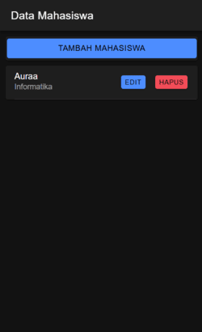
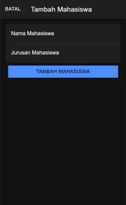
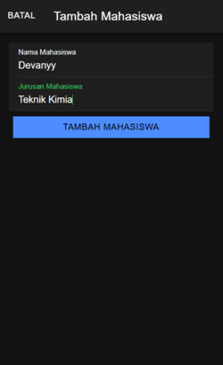
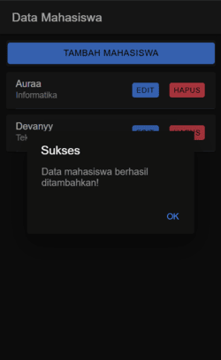

1. Tombol Tambah Mahasiswa
   
  Pada halaman utama, terdapat tombol `Tambah Mahasiswa`. Ketika tombol ini diklik, akan membuka modal `Tambah Mahasiswa` dengan memanggil fungsi `openModal('add')`.

2. Modal Tambah

   Modal ini berisi form untuk memasukkan nama dan jurusan mahasiswa.

   Form Input: Form input dilengkapi dengan atribut `[(ngModel)]="nama"` dan `[(ngModel)]="jurusan"` untuk mengikat nilai input dengan variabel dalam komponen (two-way data binding).

3. Validasi Input

   Ketika pengguna menekan tombol `Tambah Mahasiswa`, fungsi `tambahMahasiswa()` akan dipanggil. Di dalam fungsi ini, terdapat pengecekan apakah nilai nama dan jurusan telah diisi. Jika salah satu kosong, maka sistem akan memunculkan pesan kesalahan melalui fungsi `showAlert`.

4. Pengiriman Data ke Server

   Jika semua input terisi, data mahasiswa (nama dan jurusan) akan dikirimkan ke server melalui fungsi `tambah()`. Fungsi ini menggunakan `apiService` untuk melakukan HTTP POST ke server (di endpoint `tambah.php`).

5. Feedback ke Pengguna

  Jika penambahan data berhasil, sistem akan menampilkan pesan konfirmasi sukses dan memperbarui daftar mahasiswa dengan memanggil `getMahasiswa()`. Modal akan ditutup menggunakan `closeModal()`.

## Cara Kerja Read (Tampilkan Data Mahasiswa)

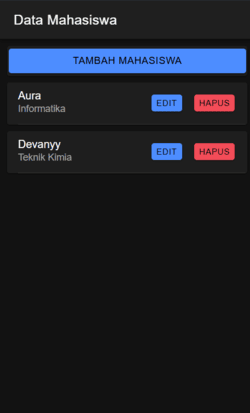

1. Fungsi Get Mahasiswa
   
  Ketika halaman `MahasiswaPage` pertama kali dimuat (fungsi `ngOnInit`), fungsi `getMahasiswa()` akan dipanggil untuk mengambil data dari server.

2. Proses Pengambilan Data

   `getMahasiswa()` memanggil `apiService.tampil()` yang mengirimkan permintaan GET ke server (di endpoint `tampil.php`). Server kemudian mengembalikan daftar mahasiswa dalam format JSON, yang disimpan ke variabel `dataMahasiswa`.

3. Menampilkan Data di Halaman

   Dengan menggunakan directive Angular `*ngFor`, setiap data mahasiswa dalam `dataMahasiswa` akan ditampilkan sebagai `ion-card` yang menampilkan nama dan jurusan. Tiap data juga memiliki tombol Hapus dan Edit untuk aksi lanjutan.

## Cara Kerja Create (Tambah Data Mahasiswa)

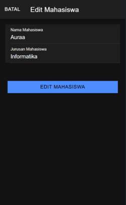
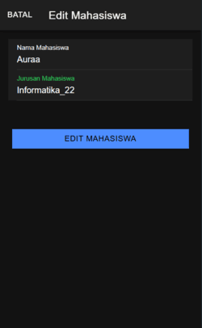
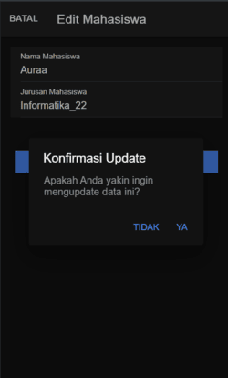
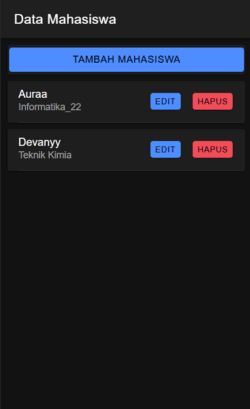

1. Tombol Tambah Mahasiswa
   
  Pada halaman utama, terdapat tombol `Tambah Mahasiswa`. Ketika tombol ini diklik, akan membuka modal `Tambah Mahasiswa` dengan memanggil fungsi `openModal('add')`.

2. Modal Tambah

   Modal ini berisi form untuk memasukkan nama dan jurusan mahasiswa.

   Form Input: Form input dilengkapi dengan atribut `[(ngModel)]="nama"` dan `[(ngModel)]="jurusan"` untuk mengikat nilai input dengan variabel dalam komponen (two-way data binding).

3. Validasi Input

   Ketika pengguna menekan tombol `Tambah Mahasiswa`, fungsi `tambahMahasiswa()` akan dipanggil. Di dalam fungsi ini, terdapat pengecekan apakah nilai nama dan jurusan telah diisi. Jika salah satu kosong, maka sistem akan memunculkan pesan kesalahan melalui fungsi `showAlert`.

4. Pengiriman Data ke Server

   Jika semua input terisi, data mahasiswa (nama dan jurusan) akan dikirimkan ke server melalui fungsi `tambah()`. Fungsi ini menggunakan `apiService` untuk melakukan HTTP POST ke server (di endpoint `tambah.php`).

5. Penyimpanan Token dan Status Otentikasi

   Ketika server mengembalikan token otentikasi, `AuthenticationService` menyimpan token ini di penyimpanan lokal menggunakan `Capacitor Preferences` melalui fungsi `saveData(token, user)`.

## Cara Kerja Create (Tambah Data Mahasiswa)

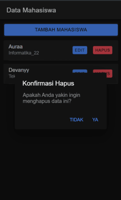
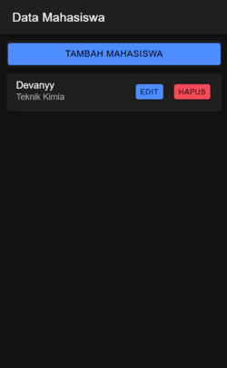

1. Tombol Tambah Mahasiswa
   
  Pada halaman utama, terdapat tombol `Tambah Mahasiswa`. Ketika tombol ini diklik, akan membuka modal `Tambah Mahasiswa` dengan memanggil fungsi `openModal('add')`.

2. Modal Tambah

   Modal ini berisi form untuk memasukkan nama dan jurusan mahasiswa.

   Form Input: Form input dilengkapi dengan atribut `[(ngModel)]="nama"` dan `[(ngModel)]="jurusan"` untuk mengikat nilai input dengan variabel dalam komponen (two-way data binding).

3. Validasi Input

   Ketika pengguna menekan tombol `Tambah Mahasiswa`, fungsi `tambahMahasiswa()` akan dipanggil. Di dalam fungsi ini, terdapat pengecekan apakah nilai nama dan jurusan telah diisi. Jika salah satu kosong, maka sistem akan memunculkan pesan kesalahan melalui fungsi `showAlert`.

4. Pengiriman Data ke Server

   Jika semua input terisi, data mahasiswa (nama dan jurusan) akan dikirimkan ke server melalui fungsi `tambah()`. Fungsi ini menggunakan `apiService` untuk melakukan HTTP POST ke server (di endpoint `tambah.php`).

5. Penyimpanan Token dan Status Otentikasi

   Ketika server mengembalikan token otentikasi, `AuthenticationService` menyimpan token ini di penyimpanan lokal menggunakan `Capacitor Preferences` melalui fungsi `saveData(token, user)`.

